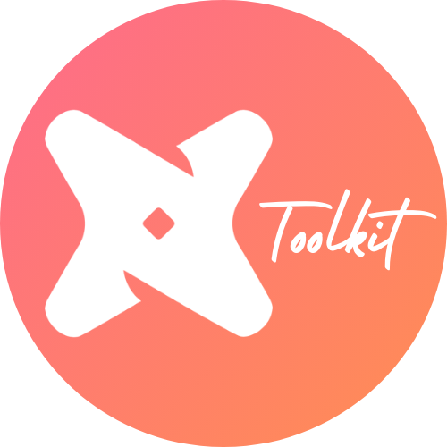
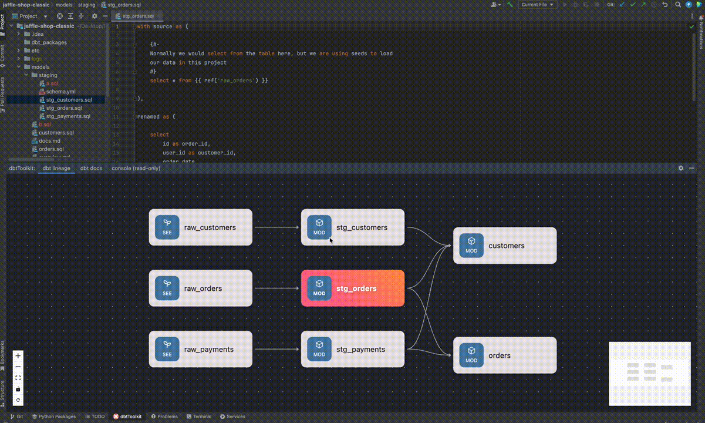

    
    <h1>dbtToolkit 🧰</h1>
    
    
    
    
    

 

<!-- Plugin description -->
The dbtToolkit is an early-stage plugin designed to enhance your experience working with [**dbt-core**](https://github.com/dbt-labs/dbt-core)
projects within JetBrains IDEs. It currently supports lineage rendering, dbt documentation, compiled SQL preview, and more!
Providing a more streamlined and integrated approach to managing your dbt projects in Jetbrains IDEs. The dbtToolkit is inspired by the
well-known VSCode plugin [**vscode-dbt-power-user**](https://github.com/AltimateAI/vscode-dbt-power-user), and aims to become an alternative
for JetBrains IDEs.

## Features
* **Lineage Rendering**: Visualize the dependencies and relationships between your dbt models directly in your IDE. 
This feature helps you understand the impact of changes and the flow of data in your project. Besides that it offers a 
quicker way to navigate through your dbt project.
* **dbt Documentation**: Access your dbt documentation within your IDE, eliminating the need to switch between different 
tools and platforms. This feature supports a more efficient workflow and keeps essential information at your fingertips.
* **Preview compiled SQL**: Preview the compiled SQL of a dbt model quickly in your IDE, and recompile a single model on
  the fly.
* **Preview data**: Preview the output data of a dbt model directly in your IDE.

## Upcoming Features
*These are features I am planning to implement in the future, however this list might change overtime*
* **Full Jinja support in SQL files**: Highlight Jinja syntax in SQL files and navigate through files by clicking
through `{{ ref() }}` and `{{ source() }}` tags.
* **... More**: I am open to suggestions and feedback, so feel free to reach out to me with your ideas!

## Prerequisites
* For IntelliJ users, it is required to have the [**Python**](https://plugins.jetbrains.com/plugin/631-python) plugin installed so that you can configure a venv.
* I also recommended to have a venv configured and [**dbt-core**](https://pypi.org/project/dbt-core/) with your required adapter installed within the venv:  
`File` > `Project Structure` > `SDK` > `Select Python` > `Select New Virtual Environment`. If not it is required to have dbt-core globally installed.
* Supported/Tested dbt versions are: >=1.7.0

If there is a venv configured within the IDE, the plugin will automatically try to use the dbt executable from the venv. 
If there is no venv configured the plugin will use the globally installed dbt version.

## Installation
You can download dbtToolkit from the JetBrains plugin marketplace. For more information on how to install JetBrains plugins, 
please refer to the [**official documentation**](https://www.jetbrains.com/help/idea/managing-plugins.html).

## Setting environment variables
If your dbt project requires environment variables (e.g. `DBT_SOME_ENV_VAR`), please set them via the plugin settings.
`File` > `Settings` > `dbtToolkit` > `Environment Variables`

There is also support for `.env` files, the plugin automatically checks for a `.env` file in the root of your project.
Via the plugin settings, you can also specify a custom path to the `.env` file.
> _Note: The global plugin environment variables will overwrite any environment variable with the same key in your 
> `.env` files_
<!-- Plugin description end -->

## Feedback and Contributions
I highly appreciate any feedback and contributions as I am developing and improving dbtToolkit. 
Feel free to report bugs, issues, or suggest features through the GitHub repository.

---
Plugin based on the [IntelliJ Platform Plugin Template][template].

[template]: https://github.com/JetBrains/intellij-platform-plugin-template
[docs:plugin-description]: https://plugins.jetbrains.com/docs/intellij/plugin-user-experience.html#plugin-description-and-presentation
